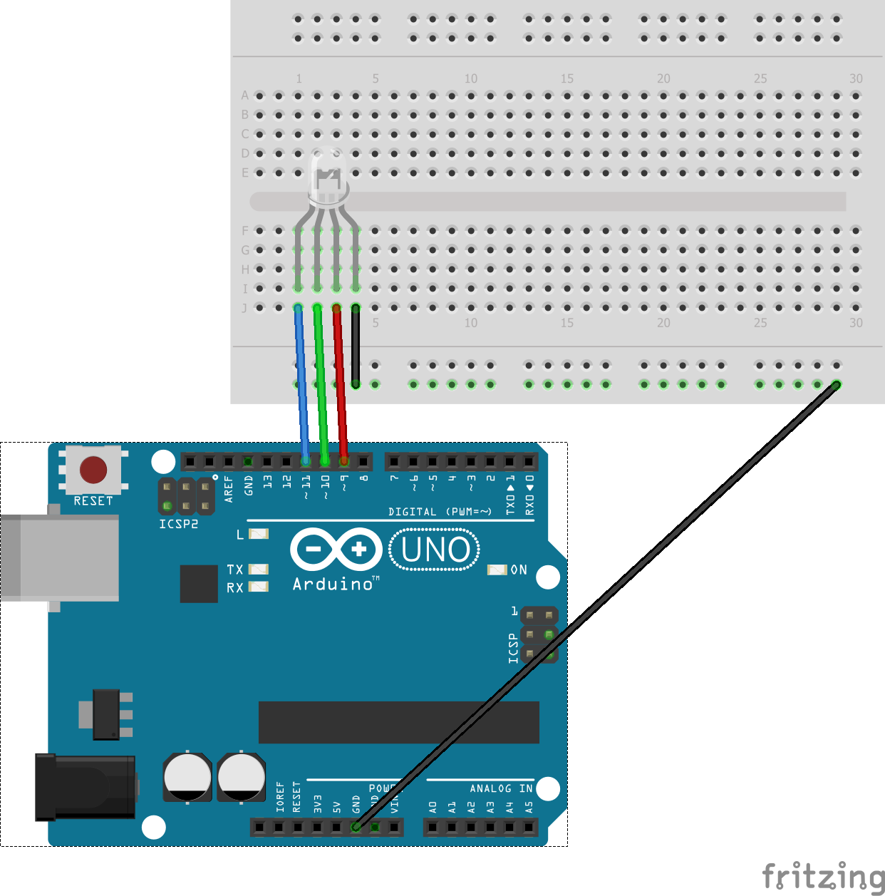

# 3-color LED SMD (KY-009)
A 3-color SMD LED which displays RED,GREEN and BLUE based on which of the pins that the current flows trough.
The module also allows for current to flow trough all three signal pins, blending RED, GREEN and BLUE color to make most of the colors on the color spectrum. 
We can also utilize PWM (Pulse-width modulation) to control the brightness of each color 

*SMD = Surface-mount Device*, Are the definition of the components usually used on circuit boards. Uses the same logic as [3-color LED - KY-011](../KY-011/)

# Sample Code
Demonstrates the different states of a RGB LED by connecting the cathode to ground and giving a signal (applying current) to the three signal pins with a variety of PWM signals.

## Board
Arduino UNO

## Component list for sample sketch
* 4 x MALE-MALE Jumper Wires

## Sample usecases
* Decoration
* Status indicator
* Disco

## Fritzing sketch

