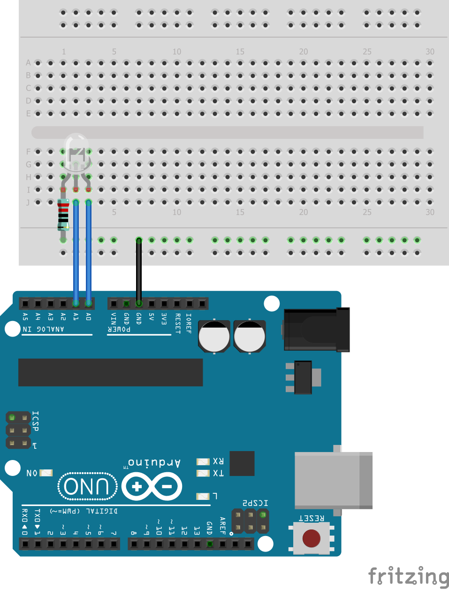

# 2-color LED Module 3mm (KY-029)

Demonstrates the different states of a Common-Cathode LED by connecting the cathode to ground and giving a signal (applying current) to the two signal pins.

## Board
Arduino UNO

## Component list for sample sketch
* 330 Ohm resistor
* KY-029 - Common-Cathode RED&GREEN LED / Yin Yi 2-color LED 3mm
* 3 x MALE-MALE Jumper Wires

## Sample usecases
* Traffic light simulator
* Christmas Decoration
* Status indicator

## Fritzing sketch

