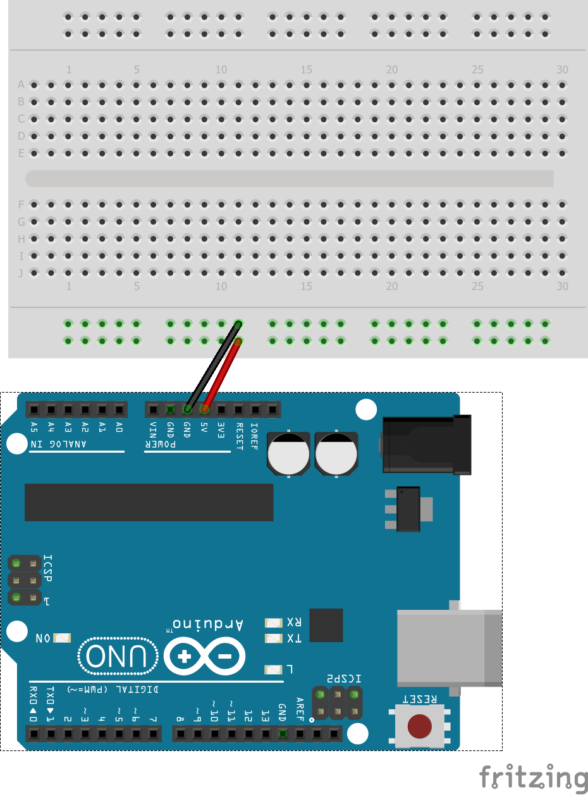

# Name of Module (Short-Name / Part name)

A Brief description of the sensor / module

# Sample Code
A brief description of what the example code demonstrates

## Board
Arduino UNO // Name of Board

## Component list for sample sketch
* 330 Ohm resistor
* 3 x MALE-MALE Jumper Wires

## Sample usecases
* Traffic light simulator
* Christmas Decoration
* Status indicator

## Fritzing sketch

